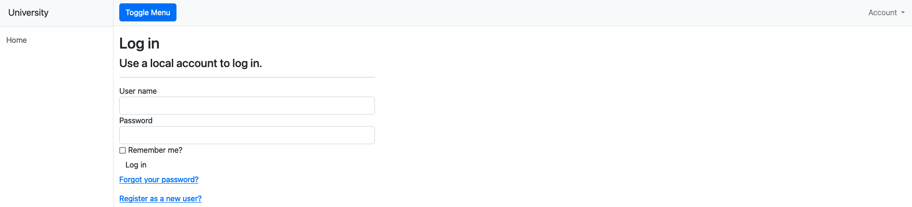
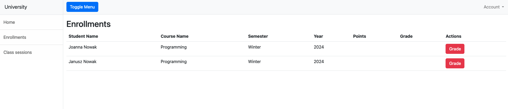
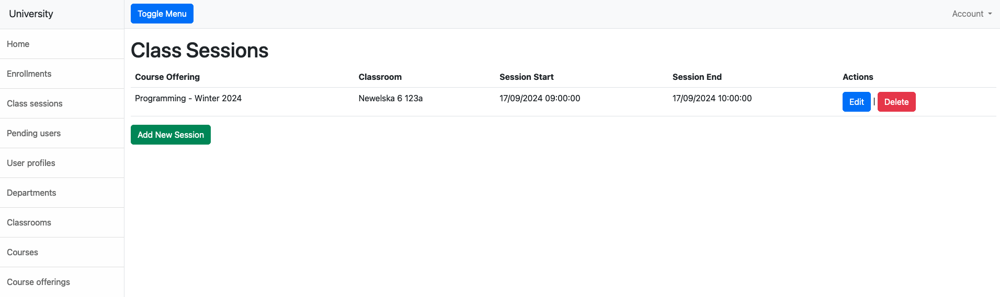

# University System

This is a rudimentary system for managing a University. Some features are missing like:
 - sending emails
 - choosing advisors
 - calculating GPA
 - applying for scholarships
 - thesis related stuff
 - deleting various entities that are related to many other entities
 - academic year management, right now this has to be done more by hand
 - https

## General Features

- The navigation bar on the right-hand side can be toggled.
- Login and role-based access control. Users are authenticated and authorized to access specific parts of the application based on their roles.
- Users can manage their account by clicking on their username under Account and change their password, email and phone number.

When accessing the website a user can register using their email and a password.

This will create the User but they will be locked out until an Administrative Employee configures their profile and thus assigns a specific role.
By default new Users email is flagged as verified since sending emails is not setup.

Users with configured and approved accounts can login or change their password.

## Role-Specific Features

### All Users

Each authorized user can access Enrollments tab but depending on their roles they'll be able to do different things, more below.

### Students

Students have the most limited possibilities in the system.
They can:
 - view their upcoming classes:

 - view courses they've enrolled to (thus view their grades):

 - enroll to courses they didn't yet:

### Professors

Professors have permissions to modify things related to handling courses that they teach:
 - view courses:

 - grade courses for specific Students:

 - view class sessions:

 - mark session attendances:

 - schedule new class sessions:

### Administrative Employees

Administrative Employees have most amount of permissions:
 - view enrollments:

 - withdraw enrollments of Students:

 - add, edit and remove class sessions

 - view and setup users pending registration:

 - manage user profiles:

    Each table can be collapsed. User profile management is straight forward. Editing an Administrative Employee, Student or Professor profile is very simple. Users without profiles can be promoted to one the aforementioned profiles and this comes with setting specific role for the new user.
 - add and edit departments:
 
 - add and edit class rooms:

 - add and edit courses:

 - add and edit course offerings:

 - add and delete deans:

    Only Professors can become deans and when they do, in addition to their existing Professor role they get Administrative Employee privileges.

## For developers

### Database setup

This was developed with MSSQL like databases in mind, using Entity Framework, so please use `dotnet ef database update --context UniversityContext` to set everything up.

### Schema

You can view the University database schema below:

### Initial data

When the system starts it'll seed the database with data required for the system to work correctly and when run in debug configuration some additional test data will be seeded - this is the data visible in screenshots above. All of this is done in `DataSeeder` class.